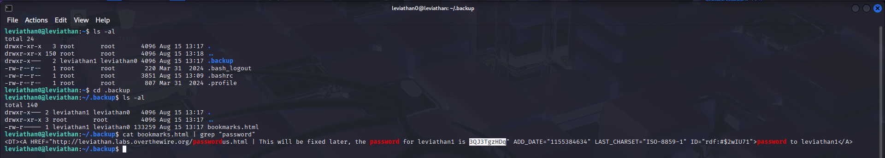

# OverTheWire Leviathan Series

## Level 1



**Password [next level]:**

```bash
3QJ3TgzHDq
```

## Level 2


**Password [next level]:**

```bash
NsN1HwFoyN
```

## Level 3


- The program uses `access()` to check if you can read the file
- Then it uses `system("/bin/cat %s")` to actually read the file
- The key is the `snprintf("/bin/cat /tmp/testfile", 511, "/bin/cat %s", "/tmp/testfile")`


**Password [next level]:**

```bash
f0n8h2iWLP
```

## Level 4


**Password [next level]:**

```bash
WG1egElCvO
```

## Level 5


**Password [next level]:**

```bash
0dyxT7F4QD
```

## Level 6


**Python Script for brute force:**

```python
import subprocess
import os

binary_path = os.path.expanduser("~/leviathan6")

for i in range(10000):
    code = f"{i:04d}"
    print(f"Trying: {code}")

    try:
        result = subprocess.run(
            [binary_path, code],
            capture_output=True,
            text=True,
            stdin=subprocess.DEVNULL,
            timeout=2
        )
    except subprocess.TimeoutExpired:
        print(f"Timeout on code {code}, skipping...")
        continue

    output = (result.stdout + result.stderr).strip()

    if result.returncode == 0 and "Wrong" not in output:
        print(f"\nSUCCESS! Code: {code}")
        print(f"Exit code: {result.returncode}")
        print(f"Output: {output}")
        break
```


**Password [next level]:**

```bash
qEs5Io5yM8
```

## Level 7


